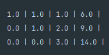

#HW 4 - Caleb Talley

## Q1
- Problem: the function just changes values to zero to make a triangular matrix instead of making sure that the new matrix is equivalent to the old matrix.
  - incorrect matrix: 
- BetterForwardElimnation algorithm fixes this by changing A[j, i] / A[i, i] for each incremented j-value
## Q2
- Problem: The problem here is with the matrix itself.  
  - The matrix that we were given has no upper triangular matrix equivalent, since x and y are not independent of each other
  - This causes A[i,i] to equal 0 at times in our diagoonal, which will lead to the majority of the last row's cells  returning "NaN" values matrix cells
    - Attempt of making Uppertriangular matrix: 
  - to make sure that this does not happen: 
    - check to make sure that the equations for varibles differ by more than just a scalar multiple
      - ex. if we know (2x+2y+z =integer) and (x+y+z =integer ), we know that x and y are dependent on each other and cannot be separated
      - ex. if we know (2x+3y+z =integer) and (x+y+z =integer ), x and y are independent of each other since we can actually separate them by adding the rows by some scalar quantity
## Q3
## Q4
- if you want to see what the room looks like with the most potential reward, look at the "question4" function in Room.java
- Squares are called "Cells" in the program

